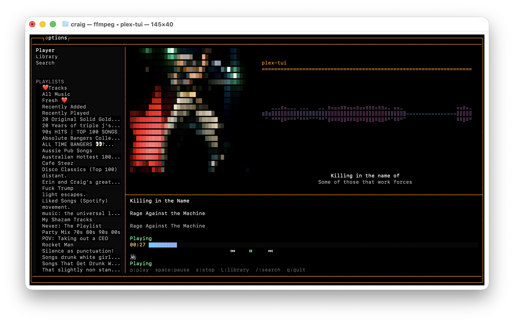

# Plex Audio btop-style TUI

A terminal user interface for Plex audio playback with real-time waveform visualization, inspired by btop.

## Features

- Terminal-based UI with 24-bit true color support
- Real-time audio waveform visualization
- Playback controls (play, pause, stop, seek)
- Library browsing (artists, albums, playlists, tracks)
- Server-side search with debouncing
- Lyrics display (time-synced and plain text)
- Album art rendering (pixelated btop-style)
- Keyboard and mouse controls
- Configurable options menu
- Optimized for large libraries (98k+ tracks)

## Screenshots




## Quick Start

### Prerequisites

- C++17 compiler (g++ or clang++)
- libcurl development files
- ffmpeg and ffplay (for audio decoding and playback)
- Terminal with Unicode and mouse support

### Installation

1. Clone the repository:
   ```bash
   git clone https://github.com/yourusername/plex-audio-btop-tui.git
   cd plex-audio-btop-tui
   ```

2. Build:
   ```bash
   make -f Makefile.main
   ```

   The executable will be created in `bin/plex-tui`.

   Note: A pre-built executable for macOS ARM64 is included in `bin/plex-tui`. This is only for macOS ARM systems. For other platforms, you must build from source.

3. Configure:
   Copy `config.example.ini` to `~/.config/plex-tui/config.ini` and edit with your Plex server details:
   ```ini
   [plex]
   server_url = http://your-plex-server:32400
   token = YOUR_PLEX_TOKEN
   ```

   To find your Plex token:
   - Open Plex Web App
   - Play any media
   - Open browser DevTools (F12) > Network tab
   - Look for X-Plex-Token in request headers (copy just the value after the colon)

4. Run:
   ```bash
   ./bin/plex-tui
   ```

## Controls

| Key | Action |
|-----|--------|
| `p` | Play/Resume |
| `Space` | Pause |
| `s` | Stop |
| `n` | Next track |
| `N` | Previous track |
| `/` | Search |
| `L` | Library view |
| `o` | Options menu |
| `q` | Quit |

## Configuration

The application uses `~/.config/plex-tui/config.ini` for settings. See `config.example.ini` for all available options.

Key settings:
- Plex server URL and token
- Window size
- Refresh rate
- Feature toggles (waveform, lyrics, album art)
- Debug log file path

## Data Sources

- **Audio and Library Data**: Fetched from your Plex server via the Plex API
- **Album Art**: Retrieved from Plex server
- **Lyrics**: 
  - Primary: LRCLIB API (https://lrclib.net) for time-synced lyrics
  - Fallback: lyrics.ovh API for plain text lyrics
- **Album Metadata** (optional): MusicBrainz API when enabled

## Building

```bash
# Build
make -f Makefile.main

# Clean
make -f Makefile.main clean
```

For detailed build instructions, dependencies, and architecture information, see [PROJECT.md](PROJECT.md).

## License

MIT License - See LICENSE file for details

## Acknowledgments

- btop++ by aristocratos - Inspiration for terminal rendering and architecture
- Plex - Media server platform
